# Test Mermaid trên GitHub
## Biểu đồ đầu tiên của tôi
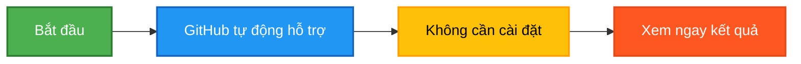
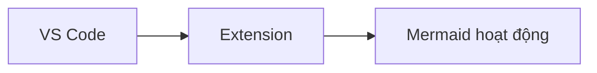

Cú pháp cơ bản:

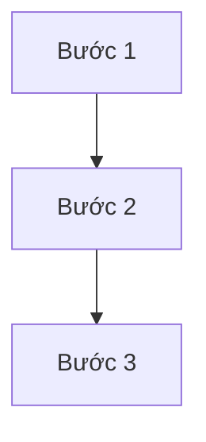

Các hình dạng node:

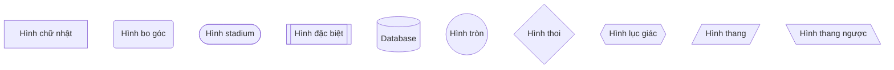

Các loại mũi tên:

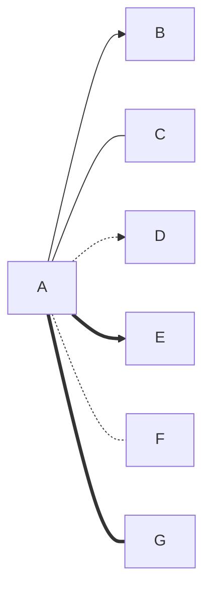

Thêm text trên mũi tên:

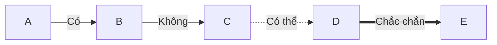

Thêm text trên mũi tên:

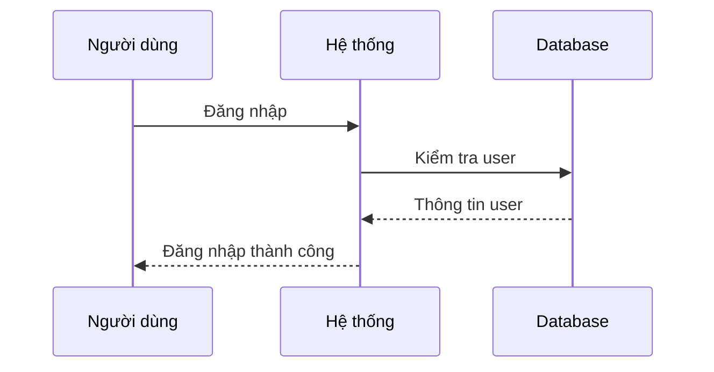

Kích hoạt (Activation):

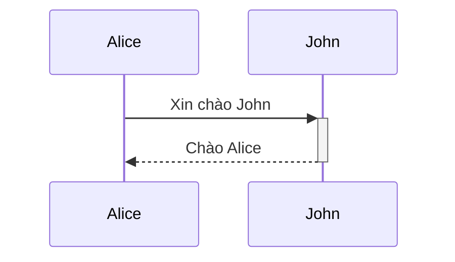

Vòng lặp và điều kiện:

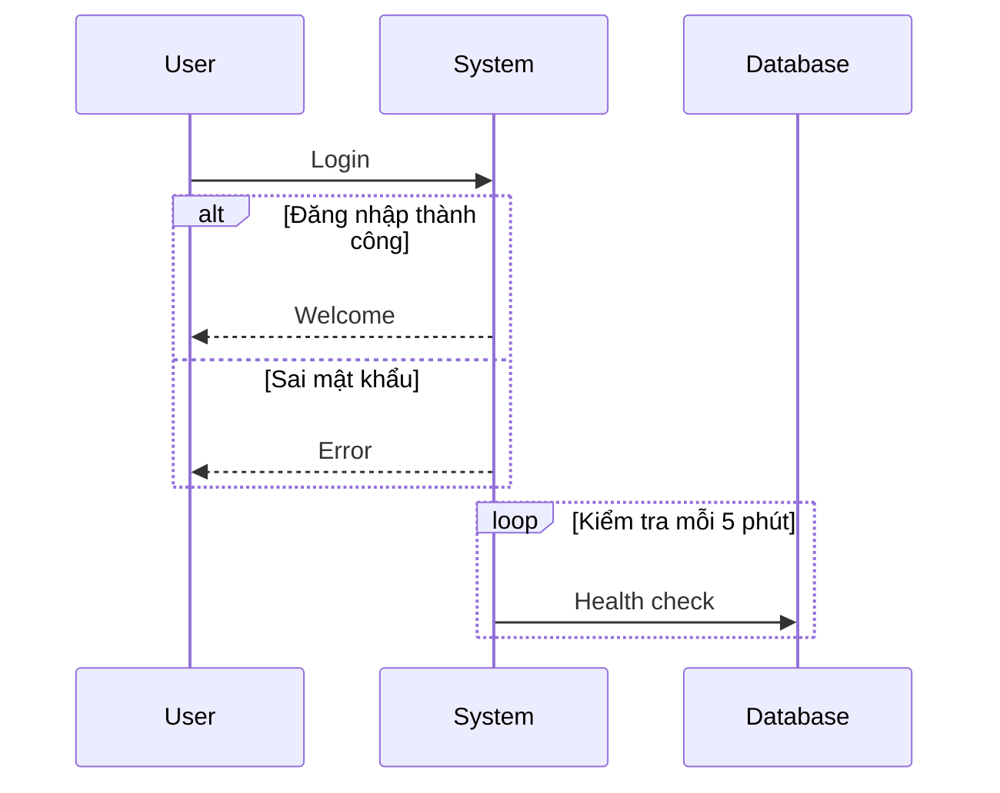

CLASS DIAGRAM - Biểu đồ lớp

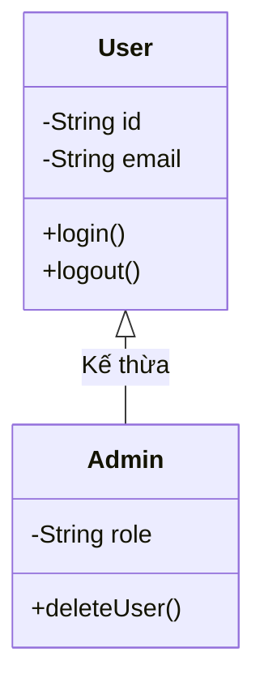

STATE DIAGRAM - Biểu đồ trạng thái

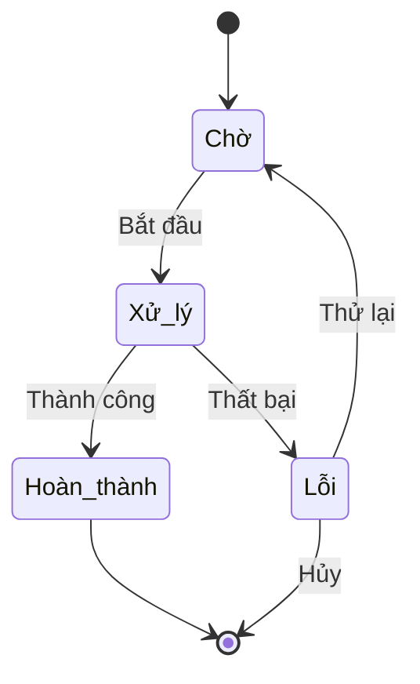

ER DIAGRAM - Biểu đồ quan hệ thực thể

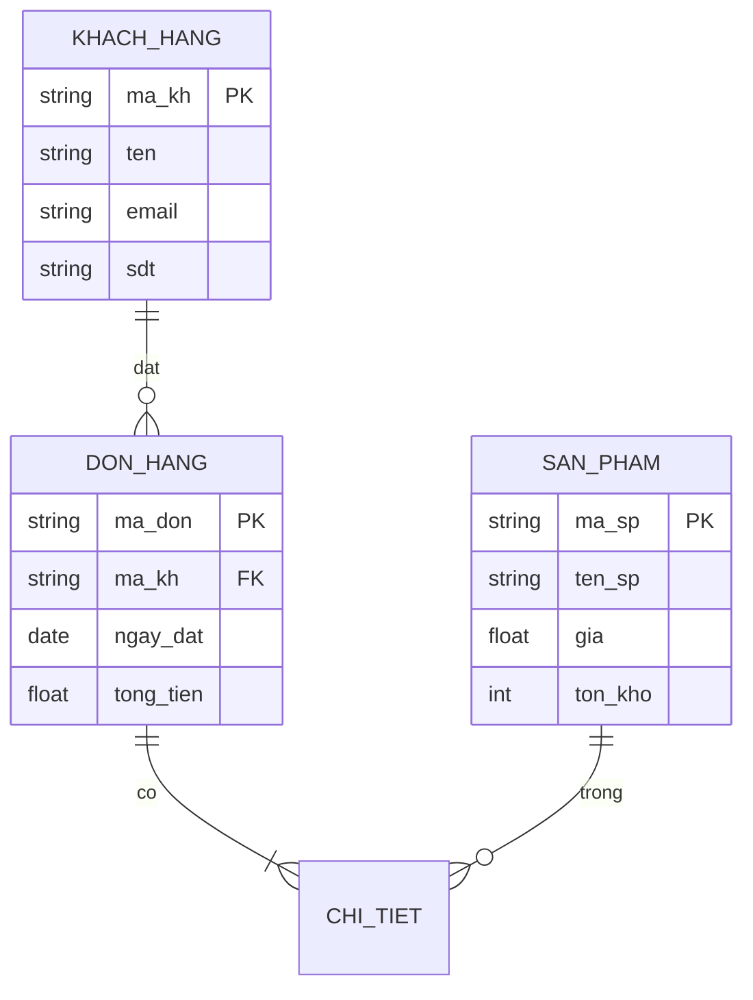

GANTT CHART - Biểu đồ Gantt

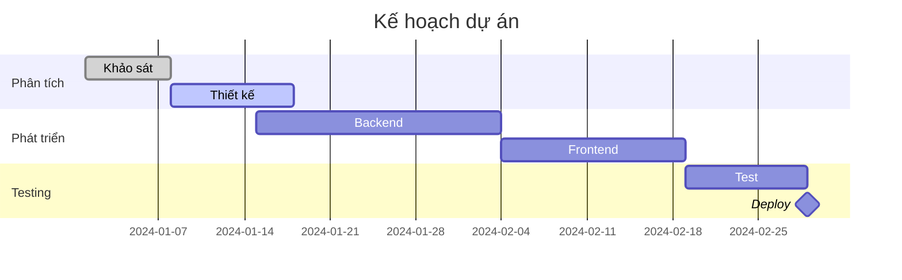

PIE CHART - Biểu đồ tròn

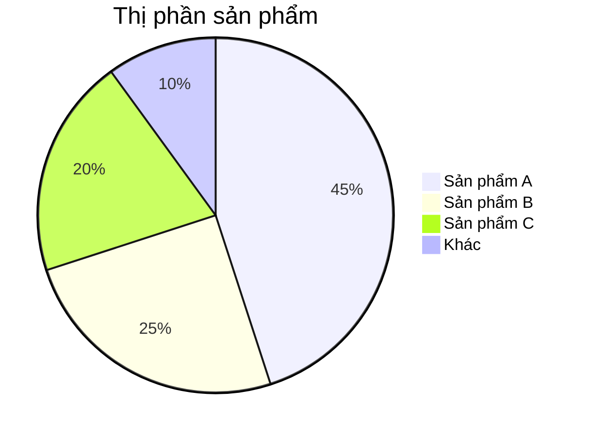

Vẽ flowchart quy trình đăng ký

1.

```mermaid
graph TD
```

Bước 2: Thêm các bước

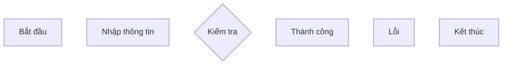

Bước 3: Nối các bước

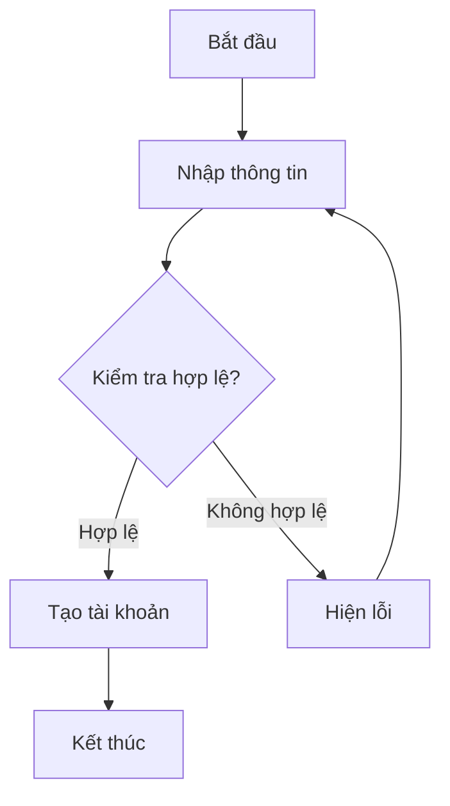

Vẽ tương tác API
Vẽ sequence diagram gọi API

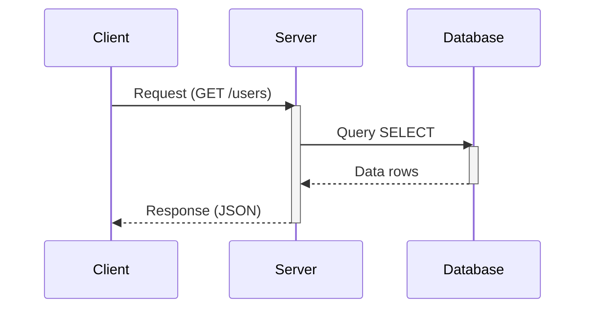

BÀI TẬP 3: Thiết kế class OOP

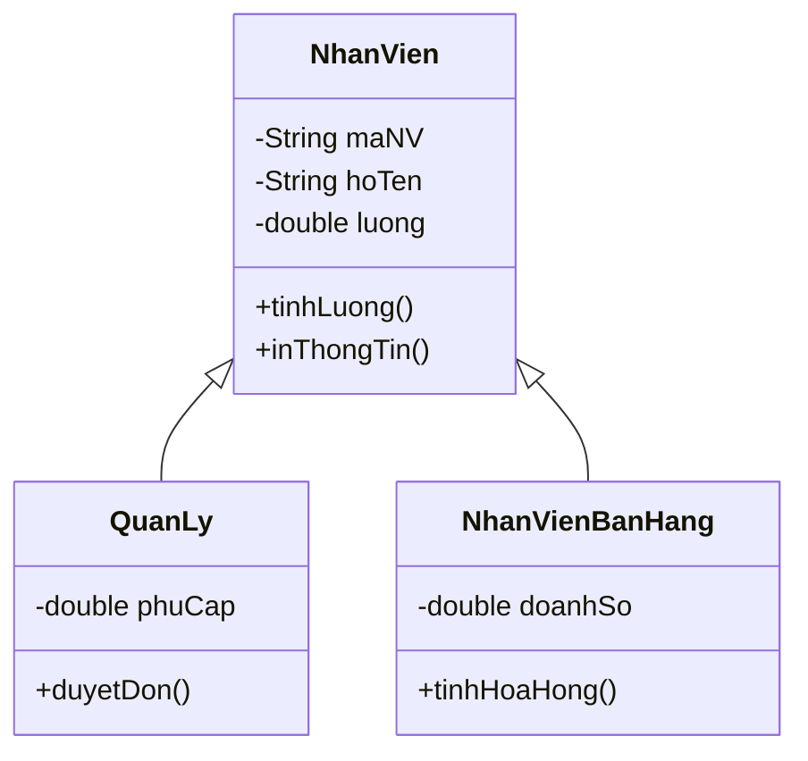

Hệ thống E-commerce

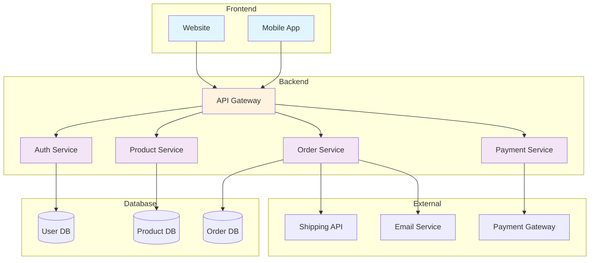

Quy trình vay vốn ngân hàng

```mermaid
flowchart TD
Start([Khách hàng có nhu cầu vay])
Consult[Tư vấn viên tư vấn]
Docs[/Chuẩn bị hồ sơ/]
Submit[Nộp hồ sơ]
Review{Thẩm định}
Approve{Phê duyệt?}
Sign[Ký hợp đồng]
Disburse[Giải ngân]
Reject[Từ chối]
Supplement[Bổ sung hồ sơ]
End([Kết thúc])
Start --> Consult
Consult --> Docs
Docs --> Submit
Submit --> Review
Review -->|Đầy đủ| Approve
Review -->|Thiếu| Supplement
Supplement --> Submit
Approve -->|Đồng ý| Sign
Approve -->|Không| Reject
Sign --> Disburse
Disburse --> End
Reject --> End
style Start fill:#c8e6c9
style End fill:#ffcdd2
style Approve fill:#fff9c4
style Review fill:#fff9c4
```

Luồng xác thực 2FA

```mermaid
sequenceDiagram
autonumber
actor User
participant App
participant Server
participant SMS
participant DB
User->>App: Nhập username/password
App->>Server: POST /login
Server->>DB: Kiểm tra credentials
DB-->>Server: User valid
Server->>SMS: Gửi OTP
SMS-->>User: SMS: Mã OTP 123456
Server-->>App: Yêu cầu OTP
User->>App: Nhập OTP
App->>Server: POST /verify-otp
Server->>DB: Kiểm tra OTP
alt OTP đúng
DB-->>Server: OTP valid
Server->>Server: Tạo JWT token
Server-->>App: Token + Success
App-->>User: Đăng nhập thành công
else OTP sai
DB-->>Server: OTP invalid
Server-->>App: Error
App-->>User: OTP không đúng
end
Note over User,DB: Quá trình xác thực 2 lớp hoàn tất
```

MẸO VÀ THỦ THUẬT

1. Thêm màu sắc

```mermaid
graph TD
A[Node A]:::classGreen
B[Node B]:::classRed
C[Node C]:::classBlue
A --> B
B --> C
classDef classGreen fill:#9f6,stroke:#333,stroke-width:2px
classDef classRed fill:#f96,stroke:#333,stroke-width:2px
classDef classBlue fill:#69f,stroke:#333,stroke-width:2px
```

2. Subgraph lồng nhau

```mermaid
graph TB
subgraph "Hệ thống"
subgraph "Frontend"
A[React]
B[Vue]
end
subgraph "Backend"
C[Node.js]
D[Python]
end
end
A --> C
B --> D
```

3. Note và comment

```mermaid
graph LR
A[Start] --> B[Process]
B --> C[End]
A -.->|Note| D[This is a note]
%% This is a comment - won't show
```

4. Đánh số tự động

```mermaid
sequenceDiagram
autonumber
Alice->>John: Message 1
John-->>Alice: Message 2
Alice->>John: Message 3
```


